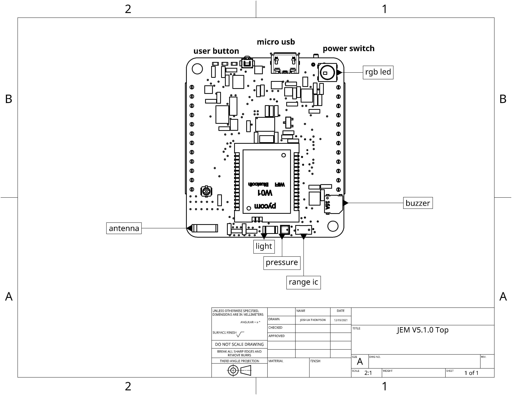

# JEM Micropython
Micropython code for JEM core

## Quickstart
### Install Thonny IDE
- [Thonny IDE Download](https://github.com/thonny/thonny/releases)
- Configure Thonny to talk to JEM ESP32 MCU
   + In top toolbar click 'Run' -> 'Configure interpreter'
   + Select 'MicroPython (ESP32)' from dropdown list of MicroPython options
   + Select 'Try to detect port automatically' from select Port dropdown list
- Reset JEM board and plug into computer via micro usb
- In Thonny shell / terminal you should be able to communicate with JEM REPL (press enter to see REPL prompt)
- In left hand side of Thonny IDE you should see the file explorer for your JEM device ('MicroPython Device')
   + Add a print('hello world') to your main.py file and then click save and the JEM will automatically update with new code
- You can also add new directories and files to JEM via the file explorer, just right click and select new directory or file
- That's it!

### Flash latest Kitlab JEM Micropython to board
- Download / unzip latest Kitlab JEM micropython [release](https://github.com/kitlab-io/micropython/releases)
- Open Thonny IDE (if you don't have it open already)
- In the 'This Computer' file explorer on left hand side navigate to where you downloaded JEM Micropython Library
   + ex: /Users/YourName/downloads/micropython-window-kit-v1.0.0
- Open the micropython-window-kit-v1.0.0/micropython/api/jem directory (where the file main.py lives)
   + **IMPORTANT:** you must be in the 'api/jem' directory when flashing code to JEM or device will not work properly
- Turn on JEM board and connect to USB and make sure Thonny shell can talk to JEM (press enter to see REPL prompt)
- In the **micropython-window-kit-v1.0.0/micropython/api/jem** directory click on the hamburger menu on the right side of the file explorer and click 'Upload to /'
- It may take 1 - 2 minutes but the JEM should now have the latest code
- At the bottom of the file explorer you should see that the JEM's internal file system ('MicroPython Device') has updated with the new code

### Run Demo application
- JEM Micropython code comes installed with a simple demo app
- Interact with JEM Demo App using following micropython commands from REPL (using Thonny IDE shell)
```bash
>> from jem import Jem
>> jem = Jem() # create jem board object
>> jem.led.set_color(0x880000) # jem red rgb led
>> jem.led.set_color(0x000088) # jem blue rgb led
>> jem.imu.orientation # show roll, pitch, yaw degrees
>> jem.buzzer.start(freq_hz = 100) # make buzzer sound
>> jem.buzzer.stop()
>> jem.btn.read() # read button value
```

## Advanced
Users can control JEM gpio, pwm, adc, dac, uart and read from sensors

### Simple GPIO test
```python
from machine import Pin

# initialize `21` in gpio mode and make it an output
p_out = Pin('21', mode=Pin.OUT)
p_out.value(1)
p_out.value(0)
p_out.toggle()
p_out(True)
```

- For more examples see [MicroPython ESP32 Docs](https://docs.micropython.org/en/latest/esp32/quickref.html#pins-and-gpio)

### JEM Sensors
```python
from jemimu import JemIMU
imu = JemIMU()
imu.orientation

from jembattery import JemBattery
batt = JemBattery()
batt.state_of_charge() # 0 - 100%

from jemrange import JemRange
range = JemRange()
range.distance

from jemlight import JemLight
light = JemLight()
light.intensity()

from jembarometer import JemBarometer
bar = JemBarometer()
bar.read()

from drivers import button
btn = button.Button()
btn.read() # should return 0 or 1 depending if pressed

# add buzzer instructions

# add rgb led instructions
```

## Connect over WiFi
- Open Atom IDE and connect to JEM over Pymakr terminal
- In REPL type
```bash
>> from jemwifi import *
>> wifi = setup_wifi(name="JemWifi") # can use any name you want
```
- Open your Wifi network and look for 'JemWifi' then connect
- Now go back to Atom IDE and click 'Connect'
   + select '192.168.4.1'
   + If you don't see an IP Address option restart Atom
- Now you can talk to JEM over Wifi and don't need USB cable
- To keep this setting after reset, put the following code in main.py
```python
from jemwifi import *
wifi = setup_wifi(name="JemWifi")
```
- Then 'Upload' code to board

## JEM Board

